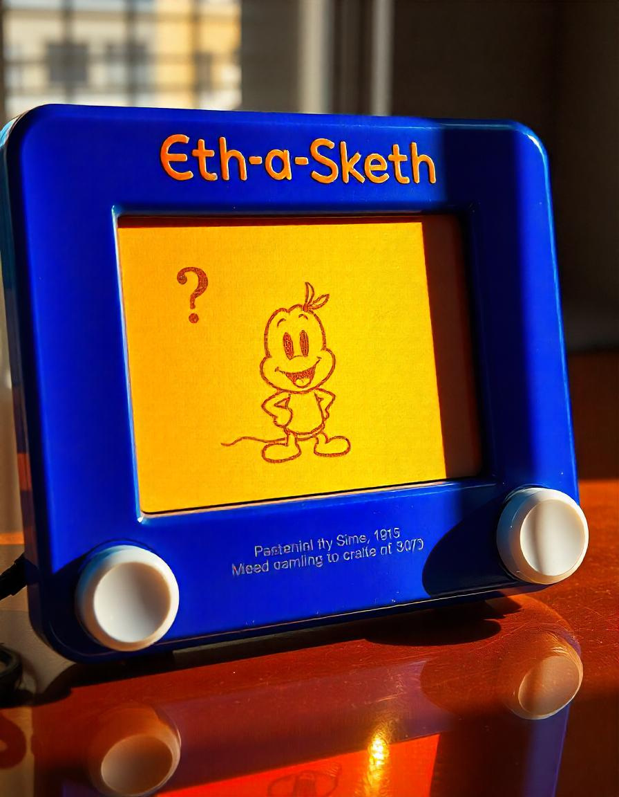

## Etch-a-Sketch

  <!-- generate on freepik.com --> 

  

### How to Play:
    - Set the Grid size, it ranges from 16 to 100(by default, it's set to 16)
    - hover the mouse over the Grid on-screen
    - go crazy
    - click on the reset button to reset the grid back to default state

   

It took me around 3 hours, from start till end, to finish this project. By some miracle, there were no bugs in the program, everything ran smoothly.

In future, I'm planning on adding a feature for users to toggle between hover and buttondown, where buttondown would make it so that, the divs change colors only if the user clicks on them instead of hovering the mouse pointer over it. 14:13, 14th October, 2024 rn, haven't eaten lunch yet :( .